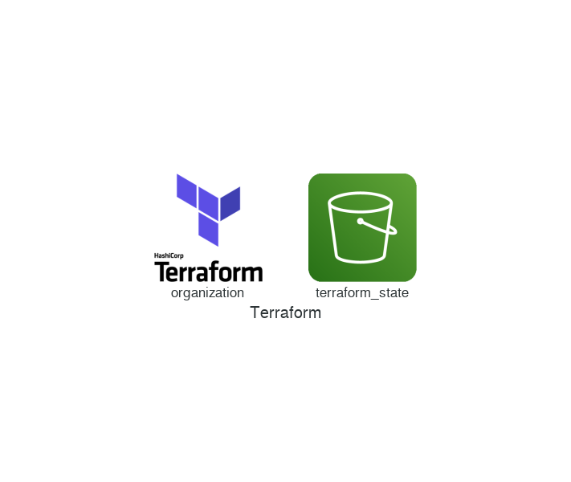

## Requirements

No requirements.

## Providers

No provider.

## Inputs

| Name | Description | Type | Default | Required |
|------|-------------|------|---------|:--------:|
| admin | Email address of the organization admin | `any` | `null` | no |
| backend\_type | Type of Terraform backend to provision | `string` | `"s3"` | no |
| membership | A list of organization team member email addresses | `list(string)` | `[]` | no |
| mfa\_delete | Enable MFA delete for versioned objects | `bool` | `false` | no |
| name | Name of the organization | `any` | `null` | no |

## Outputs

No output.

